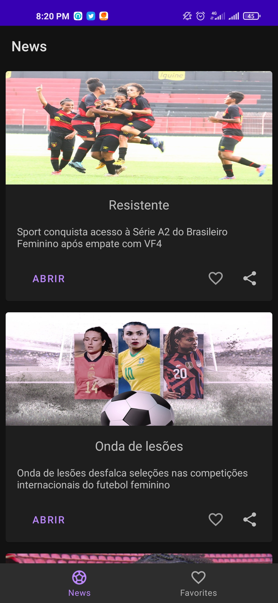
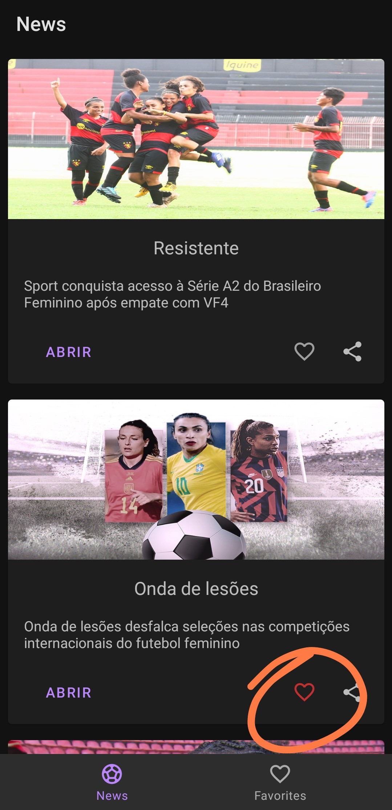

# Soccer News app
<h1>Aplicativo que mostra noticias de futebol feminino</h1>
  
 
 

  
uriliza uma simulação de API contida aque no Github: https://github.com/EriqueRocha/soccer-news-api 

  
 
Ao iniciar o aplicativo ele mostra o carregamento

As noticias carregadas

O aplicativo permite compartilhar a noticia original apartir do link contido na API simulada

O aplicativo também permite curtir as noticias e separalas em outra aba

